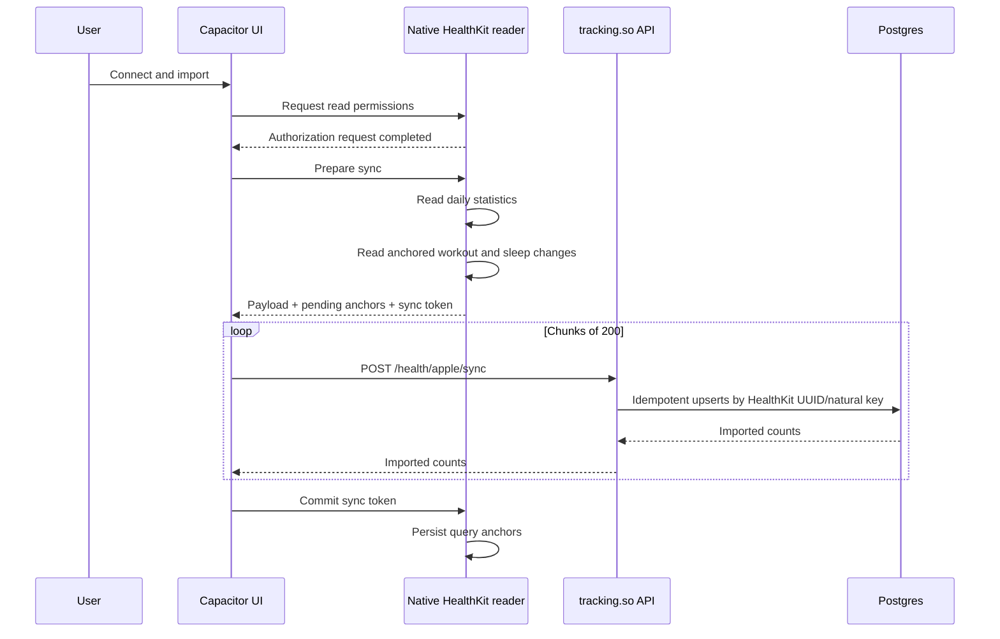

# Native Apple Health integration

## Product outcome

The integration first imports Apple Health data into a correlation-ready store.
Workout reconciliation is a separate, explicit confirmation step: nothing is
added to or linked with the tracking.so timeline until the user reviews the
proposed changes.

The native iPhone app can request read-only access to:

- Workouts.
- Sleep analysis and sleep stages.
- Steps, active energy, Apple exercise time, walking/running distance, and
  flights climbed.
- Resting heart rate, HRV (SDNN), respiratory rate, oxygen saturation, and body
  mass.

An initial connection reads 180 days. A normal foreground refresh recomputes the
latest 14 days of daily values and uses HealthKit anchors for workout and sleep
changes.

## Why the data is shaped this way

The existing `MetricEntry.rating` is a subjective 1–5 observation. HealthKit
values are objective quantities with units, provenance, intervals, corrections,
and deletions. Converting sleep or resting heart rate to a 1–5 score would erase
the information needed for useful correlations.

The integration therefore uses three shapes:

1. `HealthDailyMetric` holds a normalized value for a local calendar date.
   Quantity values come from `HKStatisticsCollectionQuery`, which lets HealthKit
   merge overlapping device sources before a value leaves the phone.
2. `HealthWorkout` retains the event interval, workout type, duration, energy,
   distance, source, and HealthKit UUID.
3. `HealthSleepSample` retains each stage interval, source, timezone, and
   HealthKit UUID. Sleep sources must not be blindly summed because two sleep
   apps can describe the same night.

This keeps common correlation queries small while retaining the event detail
needed for lag windows and future reprocessing. It also avoids uploading
high-frequency raw heart-rate and step samples.

## Foreground sync protocol

HealthKit anchors are committed only after every API chunk succeeds. A timeout
or app termination therefore retries already-upserted data instead of losing
changes.

HealthKit intentionally does not tell an app which read permissions the user
denied. A successful authorization callback means the system permission request
completed; an empty query may mean either no data or no read permission. The UI
must not claim that every requested type was granted.

## Workout reconciliation

`HealthWorkout` remains the source record. A confirmed
`HealthWorkoutReconciliation` stores one durable decision for that workout and
optionally links it to an `ActivityEntry`. This makes retries idempotent and
keeps imported Health data separate from user-authored timeline content.

The preview classifies each workout as:

- **Match:** same local date and activity, with a strong time/value match.
- **New:** no plausible tracking.so entry exists.
- **Needs review:** ambiguous candidate, incompatible unit, material value
  difference, or an overlapping Health workout.
- **Reviewed:** the user already saved a link, import, or ignore decision.

Distance, duration, and session measures use deterministic conversions.
Measures such as repetitions or sets cannot be derived from a Health workout
and are marked incompatible. Normal sensor-versus-manual rounding is allowed
within a bounded tolerance; it is shown to the user rather than hidden.

The default confirmation behavior is:

- Strong matches: link while keeping the user-entered quantity.
- New workouts: import into a compatible existing activity, or create a
  private matching activity when none exists.
- Conflicts: make no change until the user chooses.

Linking never overwrites descriptions, private notes, photos, comments, or
reactions. Exact Health distance, duration, start, and end values enrich empty
structured fields. Using Health as the displayed quantity is a separate,
explicit choice.

## Server contract

### `GET /health/apple/status`

Returns the latest connected-device sync lifecycle. It does not claim
per-data-type authorization.

### `POST /health/apple/sync`

Accepts a bounded batch containing:

- Installation ID and requested type names.
- Daily numeric values.
- Added or updated workouts and sleep samples.
- Deleted workout and sleep UUIDs.
- First/final batch markers.

Every health payload is authenticated with the app's normal bearer token.
Validation rejects unsupported metric identifiers, invalid dates, non-finite
numbers, reversed intervals, and oversized batches.

### `GET /health/apple/workouts/reconciliation-preview`

Returns the summary counts, proposed category, mismatches, compatible
measurement comparison, and candidate tracking.so entries for every imported
workout. This endpoint is read-only.

### `POST /health/apple/workouts/reconcile`

Applies only the submitted decisions. Supported actions are link while keeping
the tracking.so value, link using the Health value, import as a new timeline
workout, and ignore. A unique source-workout decision makes retries
idempotent.

### `DELETE /health/apple?deleteData=false`

Disconnects the integration but retains already imported history.

With `deleteData=true`, it deletes all imported Apple Health data, reconciliation
records, connection records, and timeline entries created exclusively from
Apple Health. Pre-existing manual entries that were only linked are retained.
Nothing is deleted from Apple Health itself.

## Correlation plan

The correlation layer should build a dated feature matrix rather than reuse the
current activity-presence-only Pearson calculation.

For each subjective metric observation:

- Use the observation timestamp as the outcome boundary.
- Build same-day and lagged features (`0d`, `1d`, `2d`, and rolling `7d` are a
  reasonable first set).
- Treat quantity metrics as continuous values.
- Derive workout features such as count, duration, energy, and per-activity-type
  presence.
- Choose one sleep source per user (or expose source selection). Never sum
  overlapping sources.
- Preserve missingness. “No authorized/read data” is not the same as a measured
  zero.
- Require enough paired observations and show confidence intervals, not only a
  correlation percentage.
- Start with Spearman correlation alongside Pearson because health/self-rating
  relationships are often monotonic but not linear.
- Label results as associations, not causal effects. Weekday, long-term trend,
  illness, and adherence are obvious confounders.

The first useful product slice is likely:

1. Mood/energy/productivity versus prior-night sleep duration and stage mix.
2. Mood/energy versus same-day and prior-day exercise minutes.
3. Mood/energy versus rolling resting heart rate and HRV baselines.

## Privacy and App Store boundary

Health data is excluded from AI coach prompts, model traces, analytics payloads,
and general application logs. Adding health data to any AI context requires a
separate, explicit consent design and a review of every processor that could
receive it. This implementation only logs batch counts and user IDs.

Before release:

- Update the in-app and web privacy policy with the exact HealthKit types,
  storage purpose, retention/deletion behavior, and processors.
- Update App Store privacy answers for linked Health and Fitness data used for
  app functionality.
- Confirm the HealthKit capability for `so.tracking.app` in the Apple Developer
  portal and the release provisioning profile.
- Keep the integration optional and request only relevant types.
- Do not use HealthKit data for advertising, marketing, or data brokerage.
- Do not store personal health information in iCloud.

Apple references:

- [HealthKit](https://developer.apple.com/documentation/healthkit)
- [Protecting user privacy](https://developer.apple.com/documentation/healthkit/protecting-user-privacy)
- [Reading data from HealthKit](https://developer.apple.com/documentation/healthkit/reading-data-from-healthkit)
- [HKAnchoredObjectQuery](https://developer.apple.com/documentation/healthkit/hkanchoredobjectquery)
- [HKStatistics](https://developer.apple.com/documentation/healthkit/hkstatistics)
- [Sleep analysis categories](https://developer.apple.com/documentation/healthkit/hkcategoryvaluesleepanalysis)
- [App Review Guidelines](https://developer.apple.com/app-store/review/guidelines/)

## Rollout phases

### Phase 1: foreground import

Implemented:

- Native read authorization.
- Read-only 180-day initial import.
- Daily HealthKit-merged quantities.
- Source-aware sleep stage summaries.
- Anchored workout and sleep upserts/deletions.
- Two-phase anchor commit.
- Account status, disconnect, and delete-data controls.
- Imported-data coverage and count statistics.
- Explicit workout reconciliation preview and confirmation.
- Unit conversion, mismatch/ambiguity marking, and idempotent saved decisions.
- Safe removal of Apple-created timeline entries without deleting manual logs.

Required before shipping:

- Apply or verify the Prisma migrations in each environment.
- Update privacy policy and App Store privacy declarations.
- Verify authorization and real data on a physical iPhone/Apple Watch.
- Run the included reconciliation persistence tests against the deployment's
  disposable integration-test database.

### Phase 2: resilient refresh

- Register `HKObserverQuery` instances at app launch.
- Enable HealthKit background delivery and add the background-delivery
  entitlement.
- Run an anchored read after observer notifications and always call the
  observer completion handler.
- Add a safe daily-range replacement protocol so a day whose final sample was
  deleted cannot retain a stale aggregate.
- Add periodic full reconciliation without treating a denied read permission as
  proof that historical server data should be deleted.

### Phase 3: product insights

- Add a health history screen with source selection and coverage indicators.
- Build the correlation feature matrix and confidence reporting.
- Add persistent per-workout-type mapping preferences after enough explicit
  user decisions have been collected; do not infer a permanent rule from one
  confirmation.
- Add export and per-category deletion controls.
